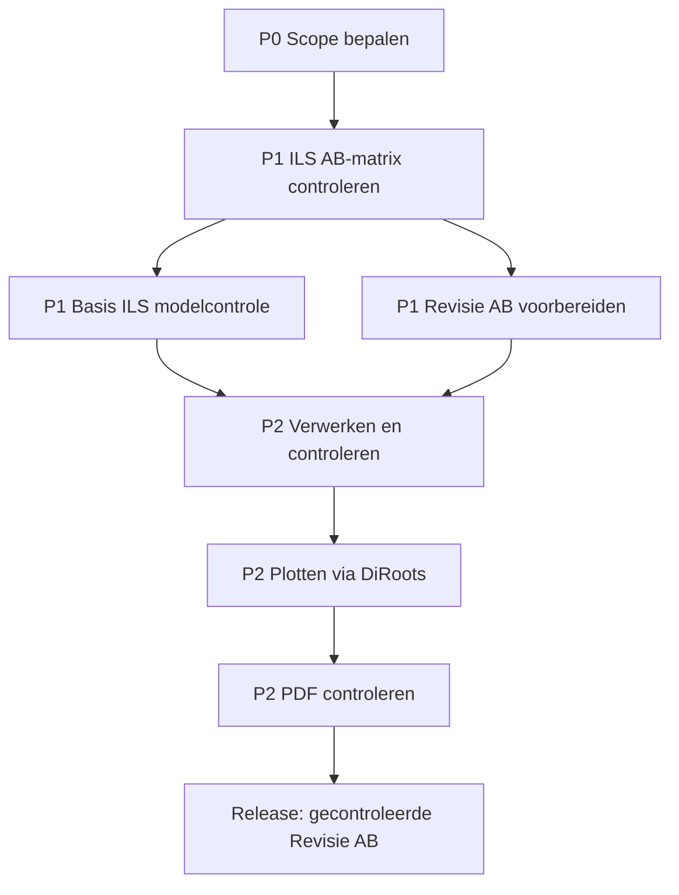

# Revit MEP Roadmap

Korte projectroadmap voor **Basis ILS**, **AB-propertycontrole** en **Revisie AB**.

## Overzicht

| Prioriteit | Onderdeel | Doel | GitHub / bron |
|---|---|---|---|
| P0 | Scope bepalen | Grenzen, inputs en output vastleggen | #1 |
| P1 | ILS AB-matrix | AB-verplichte properties per categorie controleren | `docs/ILS_AB_MATRIX.md` |
| P1 | Basis ILS | Model en documentatie toetsen aan Basis ILS | #2 |
| P1 | Revisie AB | Revisie voorbereiden en impact bepalen | #3 |
| P2 | Verwerken en controleren | Model, annotaties, views en sheets controleren | #4 |
| P2 | Outputcontrole | DiRoots/PDF/output controleren | #4 |

## Roadmap

## AB-gerichte ILS-categorieën

| Code | Categorie | Focus |
|---:|---|---|
| 51 | Warmte-opwekking | Description, Type Mark, systeeminformatie, vermogen, typeomschrijving, isolatiedikte |
| 55 | Koude-opwekking | Description, Type Mark, systeeminformatie, typeomschrijving, isolatiedikte, Tracing-open punt |
| 56 | Warmtedistributie | Description, Tracing, Type Mark, systeeminformatie, typeomschrijving, isolatiedikte |
| 57 | Luchtbehandeling | Description, Type Mark, systeeminformatie, typeomschrijving, isolatiedikte |

## Werkmethode

1. Eerst scope vastleggen.
2. Daarna AB-verplichte ILS-properties controleren.
3. Basis ILS toetsen.
4. Revisie AB voorbereiden.
5. Pas daarna verwerken, controleren en output delen.

## Open punten

- Discipline(s) in scope.
- Revit-versie.
- Tekenstandaard/projectstandaard.
- Sheets/zones voor Revisie AB.
- Exacte Revit-drager voor `Tracing` bij koude-opwekking.
- Exacte Revit-drager voor `Tracing` bij warmtedistributie.
- Definitieve systeemnaamconventie.
- Definitieve verkorte-codeconventie.
