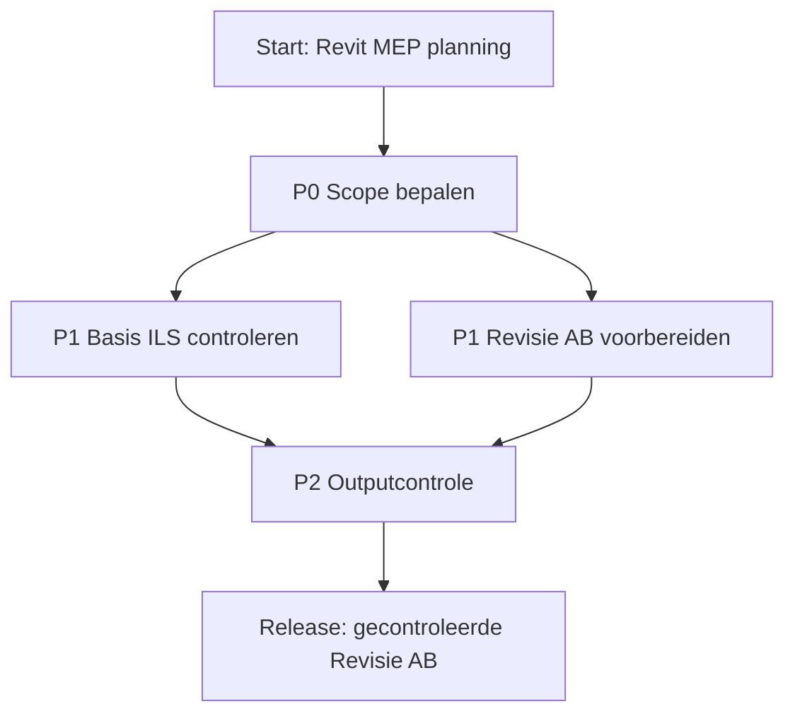

# Revit MEP Roadmap

Korte projectroadmap voor **Basis ILS** en **Revisie AB**.

## Overzicht

| Prioriteit | Onderdeel | Doel | GitHub |
|---|---|---|---|
| P0 | Scope bepalen | Grenzen, inputs en output vastleggen | #1 |
| P1 | Basis ILS | Model en documentatie toetsen aan Basis ILS | #2 |
| P1 | Revisie AB | Revisie voorbereiden en impact bepalen | #3 |
| P2 | Outputcontrole | Model/sheets/PDF controleren na verwerking | Later |

## Roadmap

## Werkmethode

1. Eerst scope vastleggen.
2. Daarna Basis ILS toetsen.
3. Revisie AB voorbereiden.
4. Pas daarna verwerken, controleren en output delen.

## Open punten

- Discipline(s) in scope.
- Revit-versie.
- Tekenstandaard/projectstandaard.
- Sheets/zones voor Revisie AB.
