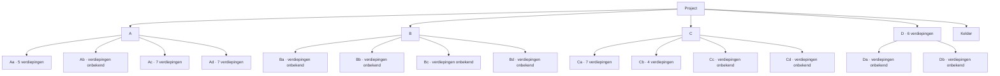

# Bouwdelenstructuur

Voorlopige bouwdelenstructuur voor Revit MEP-planning, ILS-controle en Revisie AB.

De lijst is nog niet compleet en wordt later aangevuld. Ontbrekende verdiepingsaantallen blijven bewust op **onbekend** staan; geen aannames verwerken als besluit.

## Matrix

| Hoofdbouwdeel | Subbouwdeel | Verdiepingen | Status |
|---|---|---:|---|
| A | — | onbekend | voorlopig |
| A | Aa | 5 | opgegeven |
| A | Ab | onbekend | aanvullen |
| A | Ac | 7 | opgegeven |
| A | Ad | 7 | opgegeven |
| B | — | onbekend | voorlopig |
| B | Ba | onbekend | aanvullen |
| B | Bb | onbekend | aanvullen |
| B | Bc | onbekend | aanvullen |
| B | Bd | onbekend | aanvullen |
| C | — | onbekend | voorlopig |
| C | Ca | 7 | opgegeven |
| C | Cb | 4 | opgegeven |
| C | Cc | onbekend | aanvullen |
| C | Cd | onbekend | aanvullen |
| D | — | 6 | opgegeven |
| D | Da | onbekend | aanvullen |
| D | Db | onbekend | aanvullen |
| Kelder | — | onbekend | apart bouwdeel / niveauzone |

## Controlegebruik

Gebruik deze bouwdelenstructuur om werk en controle op te knippen:

1. Per bouwdeel bepalen wat in scope is.
2. Per bouwdeel controleren welke verdiepingen geraakt worden.
3. Per bouwdeel de AB-propertycontrole uitvoeren.
4. Per bouwdeel Revisie AB-impact bepalen.
5. Per bouwdeel open punten vastleggen.

## Visuele structuur

## Open punten

- Verdiepingen voor A hoofdbouwdeel.
- Verdiepingen voor Ab.
- Verdiepingen voor B hoofdbouwdeel.
- Verdiepingen voor Ba, Bb, Bc en Bd.
- Verdiepingen voor C hoofdbouwdeel.
- Verdiepingen voor Cc en Cd.
- Relatie tussen D en Da/Db.
- Verdiepingen voor Da en Db.
- Definitie van kelder: één kelderniveau of meerdere kelderzones.
