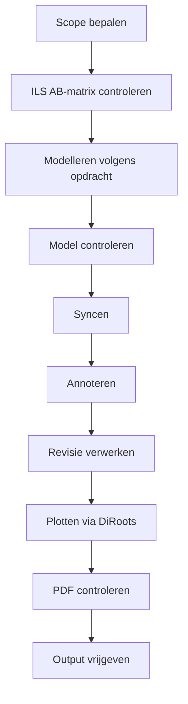

# Workflowprincipes — Revit MEP

Deze repo is ingericht als overzichts- en controlelaag bovenop het Revit MEP-werk.

## Kern

- Eerst scope, dan uitvoering.
- Eerst AB-verplichte informatie, daarna aanvullende informatie.
- Korte taken boven lange taken.
- Eén centrale checklist boven losse notities.
- Inklapbare groepen voor overzicht.
- Visuele roadmaps waar dat helpt.
- Open punten expliciet benoemen.
- Geen aannames vastleggen als besluit.

## Basisworkflow

## Centrale bronnen

| Bron | Doel |
|---|---|
| `README.md` | Repo-doel en gebruik |
| `ROADMAP.md` | Hoofdfases en globale route |
| `docs/ILS_AB_MATRIX.md` | AB-gerichte ILS-propertymatrix |
| GitHub issue `#4` | Interactieve master-checklist |

## Werkafspraak

Nieuwe informatie wordt eerst verwerkt in:

1. `docs/ILS_AB_MATRIX.md` als het om ILS-properties gaat.
2. `ROADMAP.md` als het om fases of volgorde gaat.
3. Issue `#4` als het uitvoerbare taken of controles zijn.
